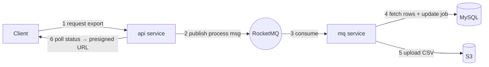
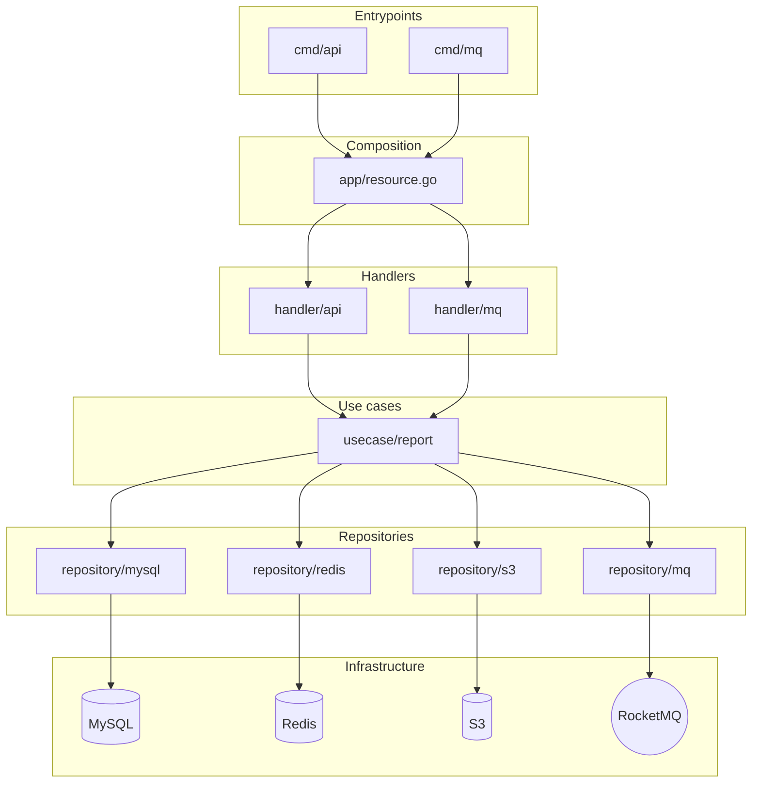
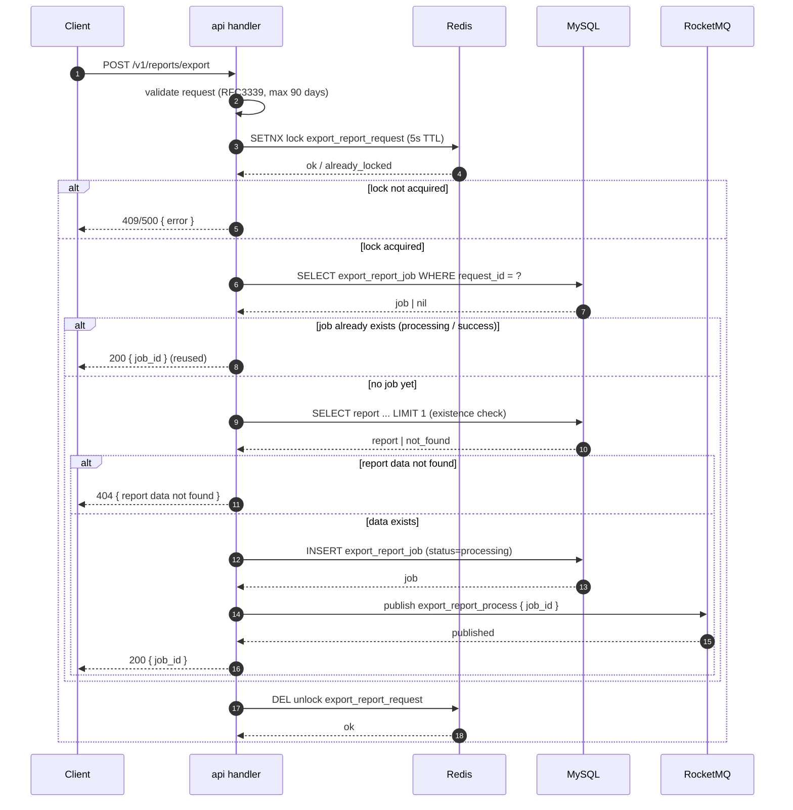
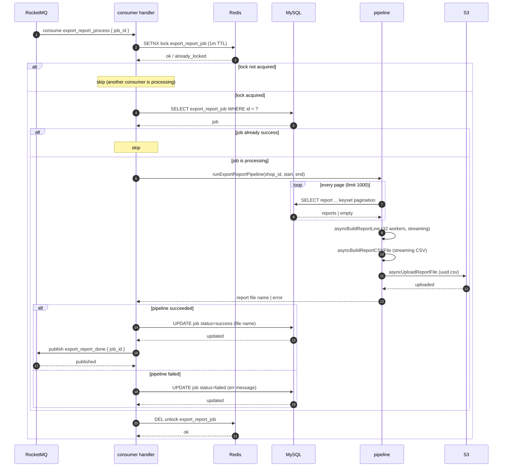
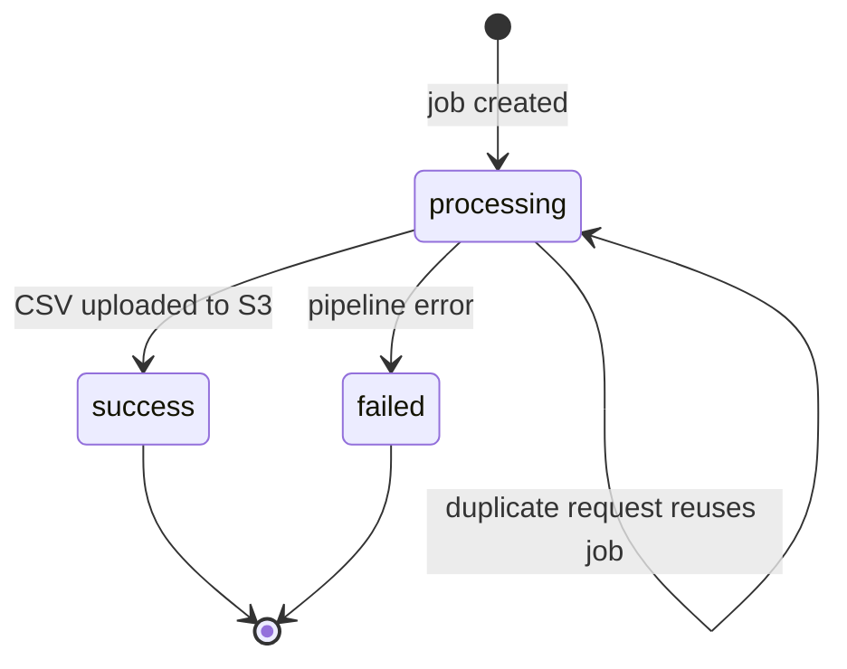
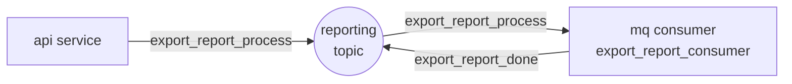
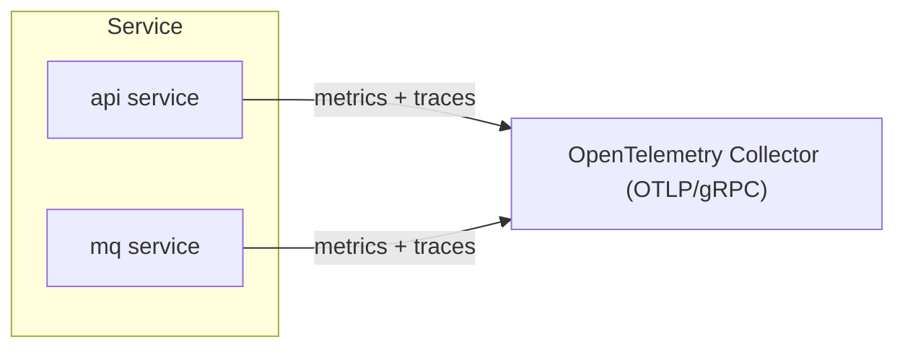

# efficient-report-exporter

[](go.mod)
[](.github/workflows/ci.yml)

Asynchronous, job-based report export service built in Go. Clients request an export via a REST API, the work is queued through **RocketMQ** and executed by a separate consumer service, and the final CSV is uploaded to **S3** and served back via a presigned download URL.

## Quick start

```bash
make db/migrate-up     # apply DB migrations
make db/seed           # seed report data
make run/api           # start the HTTP API (default :18081)
make run/consumer      # start the MQ consumer
```

Then `POST /v1/reports/export`, poll `GET /v1/reports/export/:job_id`, and download the CSV from the returned presigned URL. See [How to run](#how-to-run) for the full guide.

## Table of contents

- [Overview](#overview)
- [Architecture](#architecture)
- [Core flows](#core-flows)
- [API contracts](#api-contracts)
- [MQ contracts](#mq-contracts)
- [Configuration](#configuration)
- [Observability](#observability)
- [Unit testing](#unit-testing)
- [How to run](#how-to-run)
- [Contributing](#contributing)

## Overview

The service exports per-shop transaction reports as CSV files. Instead of blocking on a synchronous HTTP export, it runs a **job-based pipeline**:

1. `POST /v1/reports/export` accepts a request and returns a `job_id` immediately.
2. A **RocketMQ** message (`export_report_process`) kicks off asynchronous processing.
3. A dedicated **MQ consumer** service streams report rows from **MySQL**, flattens them into CSV lines, uploads the file to **S3**, and marks the job `success` (or `failed`).
4. Clients poll `GET /v1/reports/export/:job_id` until the job finishes, then download the file via a **presigned S3 URL**.

The pipeline is designed to handle large result sets: report rows are fetched page-by-page and streamed through the processing stages with bounded worker concurrency, so memory usage stays flat regardless of the number of rows.



Redis is used for distributed locks — deduplicating export requests and preventing the same job from being processed concurrently — but is omitted here for clarity (see [Core flows](#core-flows)).

## Architecture

The codebase follows a layered (clean-architecture style) layout:

| Layer | Path | Responsibility |
| --- | --- | --- |
| Entrypoints | `cmd/api`, `cmd/mq` | Bootstrap, lifecycle, graceful shutdown |
| Composition | `app` | Wire config, clients, repositories, and use cases into `app.Resource` |
| HTTP handlers | `handler/api` | Parse/validate requests, map errors to HTTP responses |
| MQ handlers | `handler/mq` | Decode messages, invoke use cases |
| Use cases | `usecase/report` | Business logic: request, process, get, list |
| Repositories | `repository/{mysql,redis,s3,mq}` | Data access / outbound side effects |
| Shared libs | `common/*` | `apiserver`, `db`, `redis`, `s3`, `rocketmq`, `confloader`, `observability`, `errs`, `errgroup` |
| Contracts | `idl/api`, `model/api` | Thrift IDL and generated request/response models |

The two deployable binaries (`cmd/api`, `cmd/mq`) are thin entrypoints over a shared composition root that wires handlers, use cases, repositories, and infrastructure:



## Core flows

### 1. Request export

`POST /v1/reports/export` creates (or reuses) a job and enqueues processing:



### 2. Process export (MQ consumer)

The consumer executes the streaming pipeline stage-by-stage. Each stage runs as a goroutine and data flows between them over in-memory pipes, so the whole pipeline back-pressures naturally:



### 2.1 Pipeline internals — how workers talk through data streams

Inside `runExportReportPipeline`, each stage is a worker (or worker pool) connected to its neighbours by a **typed, in-memory stream**. Data flows stage-to-stage as values, never as materialized files, and the streams apply backpressure so a slow stage throttles everything upstream.

```mermaid
flowchart LR
    F["asyncFetchReports<br/>1 producer<br/>keyset-paged SQL"]
    S1(("reportsDataStream<br/>typedpipe&#91;Report&#93;<br/>buffered chan 64"))
    W1["line worker 1"]
    W2["line worker 2"]
    Wn["line worker 32"]
    S2(("reportLineDataStream<br/>typedpipe&#91;ReportLine&#93;<br/>buffered chan 64"))
    C["asyncBuildReportCSVFile<br/>1 consumer"]
    P(("io.Pipe<br/>unbuffered"))
    U["asyncUploadReportFile<br/>1 worker → S3"]

    F -->|write| S1
    S1 -->|read| W1
    S1 -->|read| W2
    S1 -->|read| Wn
    W1 -->|write| S2
    W2 -->|write| S2
    Wn -->|write| S2
    S2 -->|read| C
    C -->|"CSV bytes"| P
    P -->|read| U
```



| Stage | Goroutines | Reads from | Writes to | Concurrency shape |
| --- | --- | --- | --- | --- |
| `asyncFetchReports` | 1 | MySQL (keyset page, limit 1000) | `reportsDataStream` | 1 → fan-out |
| `asyncBuildReportLine` | 32 (`report_line_workers`) | `reportsDataStream` | `reportLineDataStream` | fan-out → fan-in |
| `asyncBuildReportCSVFile` | 1 | `reportLineDataStream` | `io.Pipe` | fan-in → 1 |
| `asyncUploadReportFile` | 1 | `io.Pipe` | S3 | 1 |

**How it works**

- **Backpressure** — a `typedpipe` stream is a buffered channel (default capacity 64): `Write` blocks when the buffer is full and `Read` blocks when it is empty. A slow consumer therefore throttles its producer, so memory stays flat no matter how many rows are exported.
- **Fan-out / fan-in** — the single fetch stage fans out to 32 line workers, which flatten each report's fee details into one row per line; those 32 workers then fan back in to a single CSV writer. The worker count is tunable at runtime via the `report_line_workers` etcd key.
- **Error propagation** — every goroutine runs inside one shared `errgroup`; the first stage to fail calls `CloseWithError` on its stream (or returns an error to the group), which cancels the group context and tears down all stages. `Wait()` returns that first error.
- **`io.Pipe`** — the CSV writer hands bytes to the S3 uploader through a synchronous, unbuffered pipe, so the report never touches disk.

### 3. Job lifecycle



On success, `GET /v1/reports/export/:job_id` returns a **presigned S3 URL** (default 15-minute expiry). On failure, it returns the persisted error message.

## API contracts

All endpoints are defined in Thrift IDL (`idl/api/report.thrift`) and served over REST by the Hertz `api` service (default `:18081`). Every response uses a common envelope:

```json
{
  "base": { "code": 0, "message": "success" },
  "data": { ... }
}
```

### `POST /v1/reports/export` — request export

**Request body**

```json
{
  "request_id": "1234567890123456789",
  "shop_id": "9876543210",
  "start_time": "2026-08-01T00:00:00Z",
  "end_time": "2026-08-10T23:59:59Z"
}
```

| Field | Type | Constraints |
| --- | --- | --- |
| `request_id` | string (int64) | required, positive, max 64 chars |
| `shop_id` | string (int64) | required, positive, max 64 chars |
| `start_time` | string (RFC3339) | required |
| `end_time` | string (RFC3339) | required, after `start_time`, range ≤ 90 days |

**Success `200`**

```json
{
  "base": { "code": 0, "message": "success" },
  "data": { "job_id": "7890123456789012345" }
}
```

If a non-`failed` job already exists for the same `request_id`, it is reused and its `job_id` returned.

### `GET /v1/reports/export/:job_id` — get job status

**Success `200`**

```json
{
  "base": { "code": 0, "message": "success" },
  "data": {
    "job_id": "7890123456789012345",
    "status": "success",
    "download_url": "https://reports.s3.amazonaws.com/...?X-Amz-Signature=...",
    "error_message": "",
    "created_at": "2026-08-11T07:00:00Z",
    "updated_at": "2026-08-11T07:00:42Z"
  }
}
```

- `status` ∈ `processing` \| `success` \| `failed`.
- `download_url` is populated only on `success` (presigned, 15-minute expiry).
- `error_message` is populated only on `failed`.

### `GET /v1/reports/export?shop_id=...&page_token=...&limit=...` — list jobs

Query params: `shop_id` (required), `page_token` (cursor, optional), `limit` (optional, default 20, max 100).

**Success `200`**

```json
{
  "base": { "code": 0, "message": "success" },
  "data": {
    "jobs": [
      {
        "job_id": "7890123456789012345",
        "status": "success",
        "start_time": "2026-08-01T00:00:00Z",
        "end_time": "2026-08-10T23:59:59Z",
        "created_at": "2026-08-11T07:00:00Z",
        "updated_at": "2026-08-11T07:00:42Z"
      }
    ],
    "next_page_token": "7890123456789012346"
  }
}
```

`next_page_token` is omitted on the last page; pass it back as `page_token` to page through results.

### Errors

Errors are returned as the `base` envelope without `data`, with an application `code` and human-readable `message`. Server-side (5xx) errors are masked as `internal server error`.

| Code | Name | HTTP status |
| --- | --- | --- |
| `0` | `OK` | 200 |
| `1001` | `INVALID_ARGUMENT` | 400 |
| `4004` | `NOT_FOUND` | 404 |
| `5001` | `INTERNAL` | 500 |
| `5002` | `DB_INTERNAL` | 500 |
| `5003` | `CACHE_INTERNAL` | 500 |
| `5004` | `MQ_INTERNAL` | 500 |
| `5005` | `S3_INTERNAL` | 500 |

## MQ contracts

Messaging uses **RocketMQ** on a single topic with distinct tags per message type. Producers and consumers are configured in `mq_producers` / `mq_consumers` in the config file.

| Topic | Tag | Direction | Payload |
| --- | --- | --- | --- |
| `reporting` | `export_report_process` | api → consumer | `{ "job_id": "..." }` |
| `reporting` | `export_report_done` | consumer → topic | `{ "job_id": "..." }` |

**`export_report_process`** triggers report generation for a job. The consumer group is `export_report_consumer` (configurable), and the job's process lock (Redis, 1-minute TTL) ensures the same job is not processed concurrently.

**`export_report_done`** is published after a successful export and can be subscribed to for notifications (e.g. webhooks, downstream refresh). Its delivery is best-effort: a publish failure is logged and does not fail the job.



## Configuration

Configuration is layered and merged at startup:

1. **File** — `config/config.<APP_ENV>.yaml` (e.g. `config.development.yaml`), overridable via `CONFIG_PATH`.
2. **Secrets** — DB, Redis, and S3 credentials fetched from the configured secret provider (default **Infisical**).
3. **Dynamic config** — runtime-tunable pipeline settings loaded from the dynamic provider (default **etcd**), with hot reload via polling.

### Environment variables

| Variable | Default | Description |
| --- | --- | --- |
| `APP_ENV` | `development` | Selects `config/config.<APP_ENV>.yaml` |
| `CONFIG_PATH` | — | Explicit config file path (overrides `APP_ENV`) |
| `LOG_FORMAT` | `text` | `text` or `json` |
| `LOG_LEVEL` | `debug` | `debug`, `info`, `warn`, `error` |
| `APP_NAME` | `efficient-report-exporter` | Service identity for logs/metrics/traces |

### Dynamic config keys (etcd)

| Key | Default | Purpose |
| --- | --- | --- |
| `process_export_report/query_limit_per_page` | `1000` | Report rows fetched per DB page |
| `process_export_report/report_line_workers` | `32` | Parallel workers flattening report lines |
| `process_export_report/request_lock_ttl` | `5s` | Request-deduplication lock TTL |
| `process_export_report/process_lock_ttl` | `1m` | Job processing lock TTL |
| `process_export_report/csv_write_buf_size` | `1MB` | CSV writer buffer size |
| `api_handler/timeouts` | — | Per-handler timeout overrides |

## Observability

All three pillars are instrumented with **OpenTelemetry** and exported over gRPC to a collector (default `localhost:4317`):

- **Logs** — structured `slog` output routed by severity (`debug`/`info` → stdout, `warn`/`error` → stderr), carrying the current `trace.id` when available.
- **Metrics** — runtime and client-level metrics (DB, Redis, S3, RocketMQ) via the `metrics` config block; exported on a configurable interval.
- **Traces** — distributed spans across HTTP handlers, MQ consumers, and repository calls, with trace/span context propagated into outbound calls.

Config blocks (`metrics`, `tracer`) in the YAML file control endpoints, export timeouts, and intervals. Remove or comment them out to disable telemetry.



## Unit testing

Tests live next to the code they cover (e.g. `handler/api/*_test.go`, `usecase/report/*_test.go`, `repository/*`). The suite relies on **mockey** to stub functions at runtime, which requires inlining and optimization to be disabled during compilation:

```bash
make run/test
# equivalent: go test -count=1 -gcflags="all=-N -l" ./...
```

> `make run/test` must be used instead of a plain `go test ./...` — without `-gcflags="all=-N -l"` the mockey-based mocks in `common/observability` will not take effect.

CI (`.github/workflows/ci.yml`) runs on every push/PR targeting `main`:

- `lint` — golangci-lint
- `build` — `go build ./...`
- `test` — unit tests with coverage, uploading a coverage report artifact

## How to run

### Prerequisites

- Go 1.26+
- MySQL, Redis, S3-compatible storage (e.g. MinIO), and RocketMQ
- A secret store (default **Infisical**) with DB/Redis/S3 credentials, or a local setup exposing them

### 1. Configure

Create `config/config.development.yaml` (see `config/config.development.yaml` in the repo for the full schema with comments) or export the standard env vars. Point the secret/dynamic loaders at your local Infisical/etcd instances, or comment the sections out to run with only the file + env defaults.

### 2. Database

```bash
# apply migrations (reads config + Infisical secrets like the app does)
make db/migrate-up

# seed data: report, export_report_job
make db/seed

# undo migrations / reset fully
make db/migrate-down
make db/reset
```

### 3. Run the services

```bash
# API server (default :18081)
make run/api

# MQ consumer (processes export jobs)
make run/consumer
```

Both binaries read the same config; `APP_ENV`, `APP_NAME`, `LOG_FORMAT`, and `LOG_LEVEL` can be overridden per run:

```bash
APP_ENV=production LOG_FORMAT=json LOG_LEVEL=info make run/api
```

### 4. Try it

<details>
<summary>Example API calls (curl)</summary>

```bash
# request an export
curl -X POST http://localhost:18081/v1/reports/export \
  -H 'Content-Type: application/json' \
  -d '{
        "request_id": "1001",
        "shop_id": "42",
        "start_time": "2026-08-01T00:00:00Z",
        "end_time": "2026-08-10T23:59:59Z"
      }'
# => {"base":{"code":0,"message":"success"},"data":{"job_id":"..."}}

# poll the job until success
curl http://localhost:18081/v1/reports/export/<job_id>

# list jobs for a shop
curl 'http://localhost:18081/v1/reports/export?shop_id=42&limit=20'

# download the CSV from the presigned download_url
curl -o report.csv "<download_url>"
```

</details>

### Build & Docker

```bash
# build binaries into ./bin
make build

# multi-stage Docker images (distroless, non-root)
make docker/build VERSION=1.0.0
# => efficient-report-exporter-api:1.0.0, efficient-report-exporter-mq:1.0.0
```

The API image exposes port `18081`. Mount your real config over `/app/config` at runtime:

```bash
docker run -v "$PWD/config:/app/config" -p 18081:18081 efficient-report-exporter-api:1.0.0
```

## Contributing

Contributions are welcome. Please keep the following in mind:

- Follow the existing package layout and the [layer responsibilities](#architecture).
- Run the linter and the test suite before opening a PR:

  ```bash
  golangci-lint run --timeout=5m
  make run/test
  ```

- Update the Thrift IDL (`idl/api/*.thrift`) and regenerate models (`make gen-model`) whenever the API contract changes.
- Keep documentation in sync with behavior changes.
