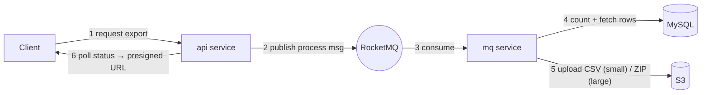
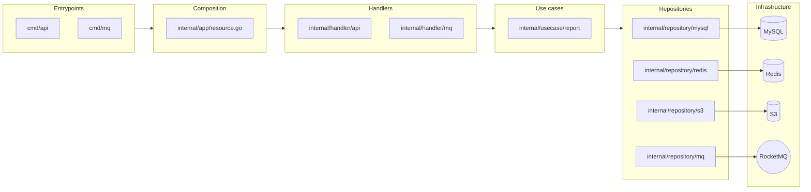
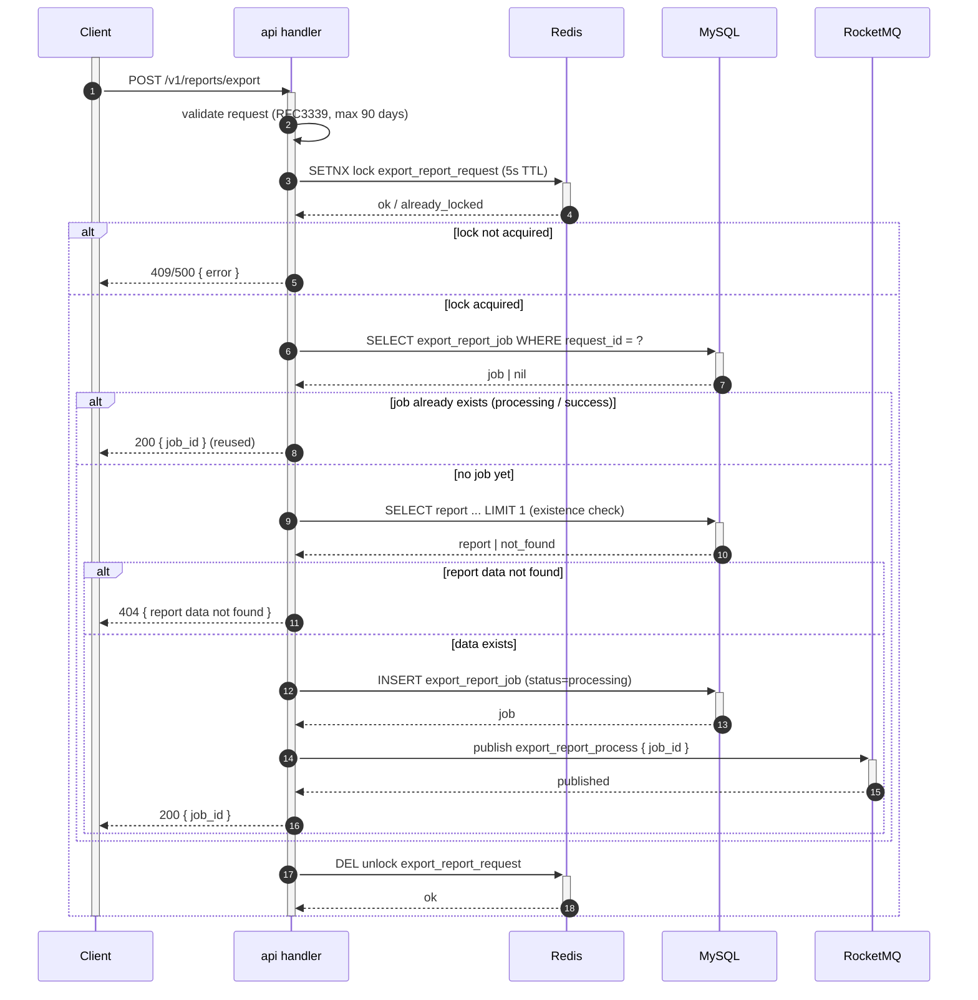
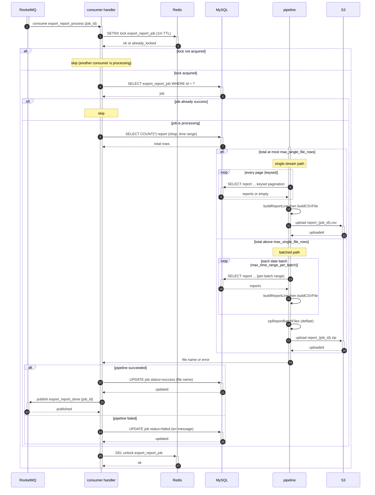
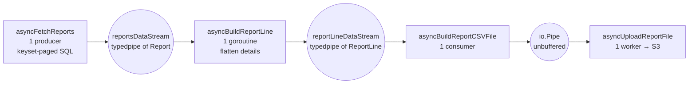
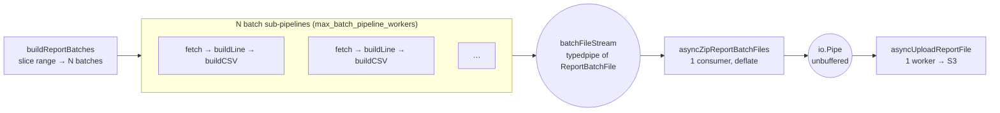
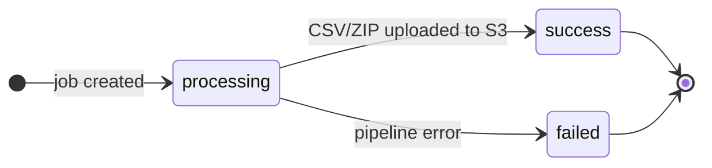
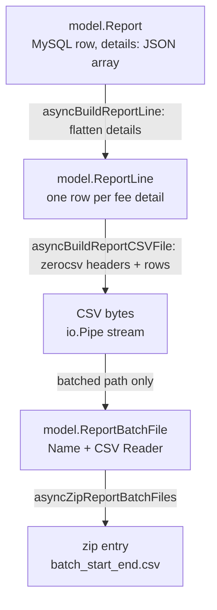
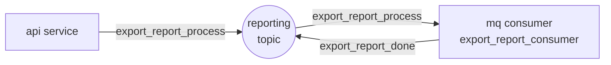
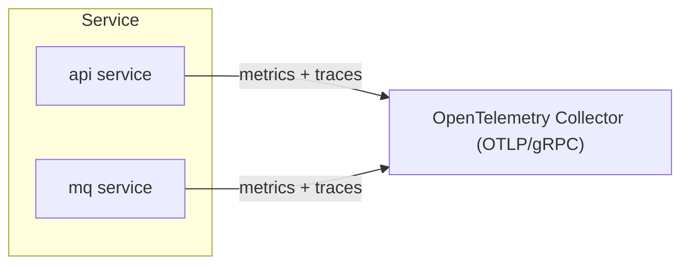

<a id="readme-top"></a>

<!-- PROJECT SHIELDS -->
[![Contributors][contributors-shield]][contributors-url]
[![Forks][forks-shield]][forks-url]
[![Stargazers][stars-shield]][stars-url]
[![Issues][issues-shield]][issues-url]
[![Go][go-shield]][go-url]

<br />
<div align="center">
  <h3 align="center">efficient-report-exporter</h3>

  <p align="center">
    An asynchronous, job-based service that exports per-shop transaction reports as downloadable <strong>CSV</strong> or <strong>ZIP</strong> files.
    <br />
    <a href="#about-the-project"><strong>Explore the docs »</strong></a>
    <br />
    <br />
    <a href="https://github.com/fikrimohammad/efficient-report-exporter">View on GitHub</a>
    &middot;
    <a href="https://github.com/fikrimohammad/efficient-report-exporter/issues/new?labels=bug">Report Bug</a>
    &middot;
    <a href="https://github.com/fikrimohammad/efficient-report-exporter/issues/new?labels=enhancement">Request Feature</a>
  </p>
</div>

<!-- TABLE OF CONTENTS -->
<details>
  <summary>Table of Contents</summary>
  <ol>
    <li><a href="#about-the-project">About The Project</a>
      <ul>
        <li><a href="#built-with">Built With</a></li>
      </ul>
    </li>
    <li><a href="#getting-started">Getting Started</a>
      <ul>
        <li><a href="#prerequisites">Prerequisites</a></li>
        <li><a href="#installation">Installation</a></li>
      </ul>
    </li>
    <li><a href="#usage">Usage</a></li>
    <li><a href="#architecture">Architecture</a></li>
    <li><a href="#core-flows">Core Flows</a></li>
    <li><a href="#pipeline-design--analysis">Pipeline Design &amp; Analysis</a></li>
    <li><a href="#api-contracts">API Contracts</a></li>
    <li><a href="#mq-contracts">MQ Contracts</a></li>
    <li><a href="#configuration">Configuration</a></li>
    <li><a href="#observability">Observability</a></li>
    <li><a href="#roadmap">Roadmap</a></li>
    <li><a href="#contributing">Contributing</a></li>
    <li><a href="#acknowledgments">Acknowledgments</a></li>
  </ol>
</details>

<!-- ABOUT THE PROJECT -->
## About The Project

The service exports per-shop transaction reports as a downloadable file. Instead of blocking on a synchronous HTTP export, it runs a **job-based pipeline**:

1. `POST /v1/reports/export` accepts a request and returns a `job_id` immediately.
2. A **RocketMQ** message (`export_report_process`) kicks off asynchronous processing.
3. A dedicated **MQ consumer** reads report rows from **MySQL** and uploads the result to **S3** — a single **CSV** for small exports, or a **ZIP** of date-partitioned CSVs for large ones — then marks the job `success` (or `failed`).
4. Clients poll `GET /v1/reports/export/:job_id` until the job finishes, then download the file via a **presigned S3 URL**.

The pipeline scales with data size: the consumer first counts the matching rows and routes to a **single-stream** path when the total is small, or a **batched** path that slices the time range into fixed-size batches and processes them in parallel before zipping — so memory stays flat regardless of the number of rows.



<p align="right">(<a href="#readme-top">back to top</a>)</p>

### Built With

* [![Go][Go]][Go-url]
* [![Hertz][Hertz]][Hertz-url]
* [![MySQL][MySQL]][MySQL-url]
* [![Redis][Redis]][Redis-url]
* [![RocketMQ][RocketMQ]][RocketMQ-url]
* [![S3/MinIO][S3]][S3-url]
* [![etcd][etcd]][etcd-url]
* [![Infisical][Infisical]][Infisical-url]
* [![OpenTelemetry][OpenTelemetry]][OpenTelemetry-url]
* [![Docker][Docker]][Docker-url]
* [![Thrift][Thrift]][Thrift-url]

<p align="right">(<a href="#readme-top">back to top</a>)</p>

<!-- GETTING STARTED -->
## Getting Started

To get a local copy running, follow these steps. The development stack (MySQL, Redis, S3-compatible MinIO, RocketMQ, Infisical, etcd, OpenTelemetry collector) is expected to be reachable at the hosts configured in `config/config.development.yaml`.

### Prerequisites

* Go 1.26+
* MySQL, Redis, an S3-compatible store (e.g. MinIO), and RocketMQ
* A secret store (default **Infisical**) holding the DB/Redis/S3/dynamic-config credentials
* **etcd** for runtime-tunable pipeline settings

### Installation

1. Clone the repo
   ```sh
   git clone https://github.com/fikrimohammad/efficient-report-exporter.git
   cd efficient-report-exporter
   ```
2. Configure the service by editing `config/config.development.yaml` (or export the standard env vars). Point the secret/dynamic loaders at your Infisical/etcd instances.
3. Apply the database migrations
   ```sh
   make db/migrate-up
   ```
4. (Optional) Seed sample data
   ```sh
   make db/seed
   ```
5. Run the services
   ```sh
   make run/api        # HTTP API on :18081
   make run/consumer   # MQ consumer that processes export jobs
   ```

<p align="right">(<a href="#readme-top">back to top</a>)</p>

<!-- USAGE -->
## Usage

Request an export and poll the job until it completes:

```sh
# request an export
curl -X POST http://localhost:18081/v1/reports/export \
  -H 'Content-Type: application/json' \
  -d '{
        "request_id": "1001",
        "shop_id": "42",
        "start_time": "2026-08-01T00:00:00Z",
        "end_time": "2026-08-10T23:59:59Z"
      }'
# => {"base":{"code":"0","message":"success"},"data":{"job_id":"..."}}

# poll the job until success
curl http://localhost:18081/v1/reports/export/<job_id>

# list jobs for a shop
curl 'http://localhost:18081/v1/reports/export?shop_id=42&limit=20'

# download the CSV/ZIP from the presigned download_url
curl -o report.csv "<download_url>"
```

_For the full API surface, see [API Contracts](#api-contracts)._

<p align="right">(<a href="#readme-top">back to top</a>)</p>

<!-- ARCHITECTURE -->
## Architecture

The codebase follows a layered (clean-architecture style) layout:

| Layer | Path | Responsibility |
| --- | --- | --- |
| Entrypoints | `cmd/api`, `cmd/mq` | Bootstrap, lifecycle, graceful shutdown |
| Composition | `internal/app` | Wire config, clients, repositories, and use cases into `app.Resource` |
| HTTP handlers | `internal/handler/api` | Parse/validate requests, map errors to HTTP responses |
| MQ handlers | `internal/handler/mq` | Decode messages, invoke use cases |
| Use cases | `internal/usecase/report` | Business logic: request, process, get, list |
| Repositories | `internal/repository/{mysql,redis,s3,mq}` | Data access / outbound side effects |
| Error codes | `internal/constant/error.go` | Application error codes and HTTP mapping (plain integers, per the `errs/v2` SDK) |
| Test doubles | `internal/mock` | gomock mocks for the app and SDK interfaces (regenerate with `make gen-mock`) |
| Shared libs | `go-dev-sdk` (vendored) | `apiserver`, `db`, `redis`, `s3`, `rocketmq`, `confloader`, `observability`, `errs`, `errgroup` |
| Contracts | `idl/api`, `idl/mq`, `internal/model/api`, `internal/model/mq` | Thrift IDL and generated request/response models |
| Integration tests | `integration` | Opt-in tests/benchmarks against real MySQL + MinIO (`-tags integration`) |

The two deployable binaries (`cmd/api`, `cmd/mq`) are thin entrypoints over a shared composition root:



<p align="right">(<a href="#readme-top">back to top</a>)</p>

<!-- CORE FLOWS -->
## Core Flows

### 1. Request export

`POST /v1/reports/export` creates (or reuses) a job and enqueues processing:



### 2. Process export (MQ consumer)

The consumer counts the matching rows and routes the job through either a single-stream or a date-batched pipeline, then uploads the result to S3:



### 2.1 Pipeline internals — how stages talk through data streams

Inside `runExportReportPipeline`, every stage is a goroutine connected to its neighbours by a typed, in-memory stream. Data flows stage-to-stage as values, never as materialized files, and the streams apply backpressure so a slow stage throttles everything upstream.

The **single** path is a linear chain:



The **batched** path slices the range, fans out per-batch sub-pipelines, and zips them into one archive:



| Stage | Goroutines | Reads from | Writes to | Used by |
| --- | --- | --- | --- | --- |
| `asyncFetchReports` | 1 | MySQL (keyset page, `query_limit_per_page`) | `reportsDataStream` | single + batched |
| `asyncBuildReportLine` | 1 | `reportsDataStream` | `reportLineDataStream` | single + batched |
| `asyncBuildReportCSVFile` | 1 | `reportLineDataStream` | `io.Pipe` | single + batched |
| `asyncBuildReportBatchFiles` | 1 fan-out + `max_batch_pipeline_workers` batch workers | MySQL (per-batch range) | `batchFileStream` | batched |
| `asyncZipReportBatchFiles` | 1 | `batchFileStream` | `io.Pipe` | batched |
| `asyncUploadReportFile` | 1 | `io.Pipe` | S3 | single + batched |

### 3. Job lifecycle



A duplicate request for a job that is still `processing` returns the existing `job_id` (no new job is created). On success, `GET /v1/reports/export/:job_id` returns a **presigned S3 URL** (default 15-minute expiry). On failure, it returns the persisted error message.

<p align="right">(<a href="#readme-top">back to top</a>)</p>

<!-- PIPELINE DESIGN & ANALYSIS -->
## Pipeline Design & Analysis

This section records the design decisions and operational characteristics behind the export pipeline — the *why* behind the flows above.

### Routing — one job, two paths

Every job is classified by **row count** before any data is streamed:

| Condition | Path | Output | Shape |
| --- | --- | --- | --- |
| `COUNT(*) ≤ max_single_file_rows` | single-stream | `report_<job_id>.csv` | serial fetch → linear chain |
| `COUNT(*) > max_single_file_rows` | date-batched | `report_<job_id>.zip` | parallel fetch → fan-out → zip |

`runExportReportPipeline` runs `CountReport` once — an index-backed `SELECT COUNT(*)` over the same `(shop_id, order_settlement_time)` range — then dispatches to `runSinglePipeline` or `runBatchedPipeline`. The threshold exists because parallel fetch only pays off past a certain volume: below it, one serial fetch producing a single CSV is simpler and cheaper than paying the fan-out and zip overhead. `max_single_file_rows` (default `100000`) is the tuning knob for that trade-off.

### Data model



- **`Report`** — one MySQL row, holding a `details` JSON array of fee details.
- **`ReportLine`** — a flattened CSV row: one line per fee detail, carrying the parent order fields (`ShopID`, `OrderID`, timestamps, `FeeID`) plus the detail columns.
- **`ReportBatch`** — a half-open `[StartTime, EndTime)` time slice with the shop id; the unit of parallelism in the batched path.
- **`ReportBatchFile`** — a named `io.ReadCloser` handed from a batch sub-pipeline to the zip stage.

### Read path — keyset pagination under a range index

The `report` table is indexed by `(shop_id, order_settlement_time, id)`. `CountReport` and `QueryReport` build the same `WHERE` clause from a single `buildReportConditions` helper (shop id + `order_settlement_time` range + keyset cursor), so the count used for routing can never drift from the rows actually fetched.

Fetching is **keyset pagination** over the index's `(order_settlement_time, id)` suffix: each page requests

```text
WHERE shop_id = ? AND order_settlement_time BETWEEN ? AND ?
  AND (order_settlement_time > :last_settlement_time
       OR (order_settlement_time = :last_settlement_time AND id > :last_id))
ORDER BY order_settlement_time ASC, id ASC
LIMIT ?
```

and advances the composite cursor to the last `(order_settlement_time, id)` returned. There is no `OFFSET`, so page cost is independent of depth. The cursor runs *within* each batch's narrower time range in the batched path, and because it is ordered by the same `(order_settlement_time, id)` suffix as the index, it is pushed into the range scan — no per-page filesort.

### Concurrency & backpressure

- Every stage is a goroutine connected to its neighbour by an in-memory stream; nothing is materialized to disk.
- **`typedpipe`** streams are buffered channels: `Write` blocks when full, `Read` blocks when empty — a slow consumer throttles its producer end-to-end.
- **`io.Pipe`** is the unbuffered, synchronous boundary between the CSV/ZIP writer and the S3 uploader.
- The batched path runs batch sub-pipelines under an `errgroup` with `SetLimit(max_batch_pipeline_workers)`; each batch gets its own `SubGroup` so its stages fail independently. The fan-out loop itself runs inside a `mainPipeline.Go` goroutine so the zip consumer is already listening before the worker pool fills and blocks.
- `errgroup` recovers panics and cancels the whole group on the first error.

### Memory & throughput

Memory stays **flat** with respect to data volume: rows stream page-by-page, bounded by `max_batch_pipeline_workers` in-flight batches and the stream/`io.Pipe` buffers. Throughput comes from the batched path's parallel DB fetch — the fetch is the bottleneck, not CSV formatting or compression.

Two costs to note in the batched path: the zip stage is a single `deflate`-compressing goroutine (CPU-bound), and each batch issues its own page queries (more, narrower queries instead of one long cursor).

### Failure & consistency model

- **Fail-fast** — the first error cancels the `errgroup`, tears down every stage, and a deferred handler persists `status=failed` with the error message. There is **no in-process retry**; retrying failed jobs is a separate (future) reconciliation concern.
- **At-least-once** — RocketMQ may redeliver a message after a crash. Re-processing is safe but not resumable: the consumer checks job status and skips `success` jobs, and a Redis lock (1-minute TTL) prevents two consumers from processing the same job concurrently. A redelivery re-runs the *whole* job from scratch.
- **Deduplication** — `POST /v1/reports/export` holds a Redis lock keyed by `request_id` and reuses an existing `processing`/`success` job for the same `request_id`.

<p align="right">(<a href="#readme-top">back to top</a>)</p>

<!-- API CONTRACTS -->
## API Contracts

All endpoints are defined in Thrift IDL (`idl/api/report.thrift`) and served over REST by the Hertz `api` service (default `:18081`). Every response uses a common envelope:

```json
{
  "base": { "code": "0", "message": "success" },
  "data": { ... }
}
```

### `POST /v1/reports/export` — request export

**Request body**

```json
{
  "request_id": "1234567890123456789",
  "shop_id": "9876543210",
  "start_time": "2026-08-01T00:00:00Z",
  "end_time": "2026-08-10T23:59:59Z"
}
```

| Field | Type | Constraints |
| --- | --- | --- |
| `request_id` | string (int64) | required, positive, max 64 chars |
| `shop_id` | string (int64) | required, positive, max 64 chars |
| `start_time` | string (RFC3339) | required |
| `end_time` | string (RFC3339) | required, after `start_time`, range ≤ 90 days |

**Success `200`**

```json
{
  "base": { "code": "0", "message": "success" },
  "data": { "job_id": "7890123456789012345" }
}
```

If a `processing` or `success` job already exists for the same `request_id`, it is reused and its `job_id` returned. A `failed` job is reset to `processing` and retried.

### `GET /v1/reports/export/:job_id` — get job status

**Success `200`**

```json
{
  "base": { "code": "0", "message": "success" },
  "data": {
    "job_id": "7890123456789012345",
    "status": "success",
    "download_url": "https://reports.s3.amazonaws.com/...?X-Amz-Signature=...",
    "error_message": "",
    "created_at": "2026-08-11T07:00:00Z",
    "updated_at": "2026-08-11T07:00:42Z"
  }
}
```

- `status` ∈ `processing` \| `success` \| `failed`.
- `download_url` is populated only on `success` (presigned, 15-minute expiry).
- `error_message` is populated only on `failed`.
- `updated_at` is an empty string while a job is still `processing`.

### `GET /v1/reports/export?shop_id=...&page_token=...&limit=...` — list jobs

Query params: `shop_id` (required), `page_token` (cursor, optional), `limit` (optional, default 20, max 100).

`next_page_token` is an empty string on the last page; pass it back as `page_token` to page through results.

### Errors

Errors are returned as the `base` envelope without `data`, with an application `code` and human-readable `message`. Server-side (5xx) errors are masked as `internal server error`.

| Code | Name | HTTP status |
| --- | --- | --- |
| `0` | `OK` | 200 |
| `1001` | `INVALID_ARGUMENT` | 400 |
| `1002` | `CONFLICT` | 409 |
| `4004` | `NOT_FOUND` | 404 |
| `5001` | `INTERNAL` | 500 |
| `5002` | `DB_INTERNAL` | 500 |
| `5003` | `CACHE_INTERNAL` | 500 |
| `5004` | `MQ_INTERNAL` | 500 |
| `5005` | `S3_INTERNAL` | 500 |

<p align="right">(<a href="#readme-top">back to top</a>)</p>

<!-- MQ CONTRACTS -->
## MQ Contracts

Messaging uses **RocketMQ** on a single topic with distinct tags per message type.

| Topic | Tag | Direction | Payload |
| --- | --- | --- | --- |
| `reporting` | `export_report_process` | api → consumer | `{ "job_id": "..." }` |
| `reporting` | `export_report_done` | consumer → topic | `{ "job_id": "..." }` |

- **`export_report_process`** triggers report generation for a job. The consumer group is `export_report_consumer` (configurable), and the job's process lock (Redis, 1-minute TTL) ensures the same job is not processed concurrently.
- **`export_report_done`** is published after a successful export and can be subscribed to for notifications. Its delivery is best-effort: a publish failure is logged and does not fail the job.



<p align="right">(<a href="#readme-top">back to top</a>)</p>

<!-- CONFIGURATION -->
## Configuration

Configuration is layered and merged at startup:

1. **File** — `config/config.<APP_ENV>.yaml`, overridable via `CONFIG_PATH`.
2. **Secrets** — DB, Redis, and S3 credentials fetched from the secret provider (default **Infisical**).
3. **Dynamic config** — runtime-tunable pipeline settings loaded from the dynamic provider (default **etcd**), with hot reload via polling.

### Environment variables

| Variable | Default | Description |
| --- | --- | --- |
| `APP_ENV` | `development` | Selects `config/config.<APP_ENV>.yaml` |
| `CONFIG_PATH` | — | Explicit config file path (overrides `APP_ENV`) |
| `LOG_FORMAT` | `text` | `text` or `json` |
| `LOG_LEVEL` | `debug` | `debug`, `info`, `warn`, `error` |
| `APP_NAME` | `efficient-report-exporter` | Service identity for logs/metrics/traces |

### Dynamic config keys (etcd)

| Key | Default | Purpose |
| --- | --- | --- |
| `process_export_report/query_limit_per_page` | `1000` | Report rows fetched per DB page |
| `process_export_report/max_single_file_rows` | `100000` | Row-count threshold below which the single-CSV path is used |
| `process_export_report/max_time_range_per_batch` | `2h` | Size of each date-range batch in the batched path |
| `process_export_report/max_batch_pipeline_workers` | `8` | Concurrent batch sub-pipelines in the batched path |
| `process_export_report/request_lock_ttl` | `5s` | Request-deduplication lock TTL |
| `process_export_report/process_lock_ttl` | `1m` | Job processing lock TTL |
| `process_export_report/csv_write_buf_size` | `1MB` | CSV writer buffer size |

<p align="right">(<a href="#readme-top">back to top</a>)</p>

<!-- OBSERVABILITY -->
## Observability

All three pillars are instrumented with **OpenTelemetry** and exported over gRPC to a collector (default `localhost:4317`):

- **Logs** — structured `slog` output routed by severity, carrying the current `trace.id` when available.
- **Metrics** — runtime and client-level metrics (DB, Redis, S3, RocketMQ) via the `metrics` config block.
- **Traces** — distributed spans across HTTP handlers, MQ consumers, and repository calls.



<p align="right">(<a href="#readme-top">back to top</a>)</p>

<!-- ROADMAP -->
## Roadmap

- [ ] **Lock renewal** — renew `process_lock_ttl` (currently a fixed 1-minute TTL) so long jobs don't have their lock expire mid-run.
- [ ] **Resume** — checkpoint per-batch progress (an `export_report_job_batch` table) so a crashed job resumes instead of restarting from zero.
- [ ] **Retry/reconciliation** — retry transient failures in-process or via a reconciliation job.
- [ ] **Deterministic zip order** — write zip entries in chronological order rather than batch-completion order.
- [ ] **Timezone-correct batch boundaries** — derive batch bounds in UTC rather than host-local time.

See the [open issues](https://github.com/fikrimohammad/efficient-report-exporter/issues) for a full list of proposed features and known issues.

<p align="right">(<a href="#readme-top">back to top</a>)</p>

<!-- CONTRIBUTING -->
## Contributing

Contributions are what make the open source community such an amazing place to learn, inspire, and create. Any contributions you make are **greatly appreciated**.

If you have a suggestion that would make this better, please fork the repo and create a pull request. You can also simply open an issue with the tag `enhancement`.

1. Fork the Project
2. Create your Feature Branch (`git checkout -b feature/AmazingFeature`)
3. Commit your Changes (`git commit -m 'Add some AmazingFeature'`)
4. Push to the Branch (`git push origin feature/AmazingFeature`)
5. Open a Pull Request

Before opening a PR, please:

- Follow the existing package layout and the [layer responsibilities](#architecture).
- Run the linter and the test suite:
  ```sh
  golangci-lint run --timeout=5m
  make run/test   # go test -count=1 -gcflags="all=-N -l" ./...
  ```
- Update the Thrift IDL (`idl/api/*.thrift`) and regenerate models (`make gen-model`) whenever the API contract changes.
- Regenerate gomock mocks (`make gen-mock`) whenever an interface changes.
- Keep documentation in sync with behavior changes.

<p align="right">(<a href="#readme-top">back to top</a>)</p>

<!-- ACKNOWLEDGMENTS -->
## Acknowledgments

* [go-dev-sdk](https://github.com/fikrimohammad/go-dev-sdk) — shared SDK for db, redis, s3, rocketmq, confloader, observability, and errgroup
* [go-typedpipe](https://github.com/fikrimohammad/go-typedpipe) — typed in-memory stream primitives
* [CloudWeGo Hertz](https://www.cloudwego.io/) — high-performance Go HTTP framework
* [Apache RocketMQ](https://rocketmq.apache.org/)
* [OpenTelemetry](https://opentelemetry.io/)
* [Best-README-Template](https://github.com/othneildrew/Best-README-Template)

<p align="right">(<a href="#readme-top">back to top</a>)</p>

<!-- MARKDOWN LINKS & IMAGES -->
[contributors-shield]: https://img.shields.io/github/contributors/fikrimohammad/efficient-report-exporter.svg?style=for-the-badge
[contributors-url]: https://github.com/fikrimohammad/efficient-report-exporter/graphs/contributors
[forks-shield]: https://img.shields.io/github/forks/fikrimohammad/efficient-report-exporter.svg?style=for-the-badge
[forks-url]: https://github.com/fikrimohammad/efficient-report-exporter/network/members
[stars-shield]: https://img.shields.io/github/stars/fikrimohammad/efficient-report-exporter.svg?style=for-the-badge
[stars-url]: https://github.com/fikrimohammad/efficient-report-exporter/stargazers
[issues-shield]: https://img.shields.io/github/issues/fikrimohammad/efficient-report-exporter.svg?style=for-the-badge
[issues-url]: https://github.com/fikrimohammad/efficient-report-exporter/issues
[go-shield]: https://img.shields.io/badge/Go-1.26-00ADD8?style=for-the-badge&logo=go&logoColor=white
[go-url]: https://go.dev/

[Go]: https://img.shields.io/badge/Go-00ADD8?style=for-the-badge&logo=go&logoColor=white
[Go-url]: https://go.dev/
[Hertz]: https://img.shields.io/badge/Hertz-6C5CE7?style=for-the-badge
[Hertz-url]: https://www.cloudwego.io/
[MySQL]: https://img.shields.io/badge/MySQL-4479A1?style=for-the-badge&logo=mysql&logoColor=white
[MySQL-url]: https://www.mysql.com/
[Redis]: https://img.shields.io/badge/Redis-DC382D?style=for-the-badge&logo=redis&logoColor=white
[Redis-url]: https://redis.io/
[RocketMQ]: https://img.shields.io/badge/Apache%20RocketMQ-D77310?style=for-the-badge
[RocketMQ-url]: https://rocketmq.apache.org/
[S3]: https://img.shields.io/badge/S3%20%2F%20MinIO-569A31?style=for-the-badge
[S3-url]: https://min.io/
[etcd]: https://img.shields.io/badge/etcd-419EDA?style=for-the-badge&logo=etcd&logoColor=white
[etcd-url]: https://etcd.io/
[Infisical]: https://img.shields.io/badge/Infisical-1F2937?style=for-the-badge
[Infisical-url]: https://infisical.com/
[OpenTelemetry]: https://img.shields.io/badge/OpenTelemetry-000000?style=for-the-badge&logo=opentelemetry&logoColor=white
[OpenTelemetry-url]: https://opentelemetry.io/
[Docker]: https://img.shields.io/badge/Docker-2496ED?style=for-the-badge&logo=docker&logoColor=white
[Docker-url]: https://www.docker.com/
[Thrift]: https://img.shields.io/badge/Apache%20Thrift-D22128?style=for-the-badge&logo=apache&logoColor=white
[Thrift-url]: https://thrift.apache.org/
