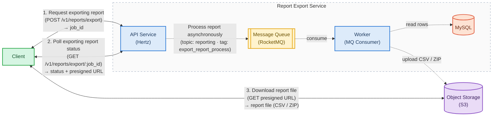
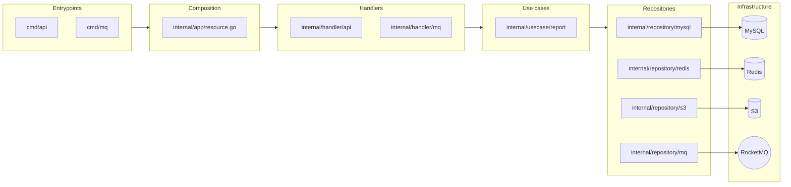
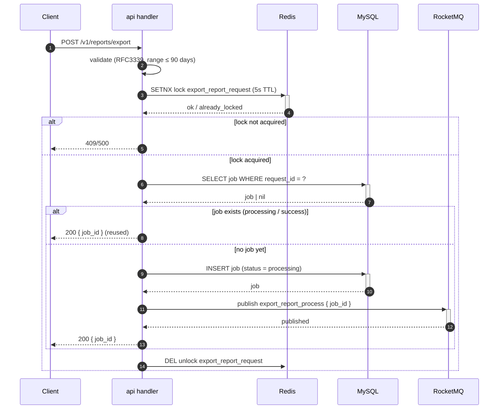
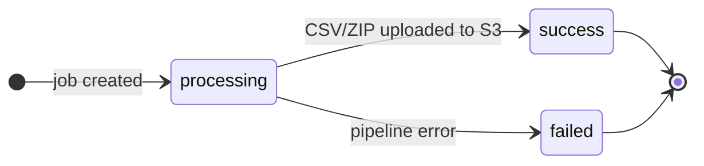
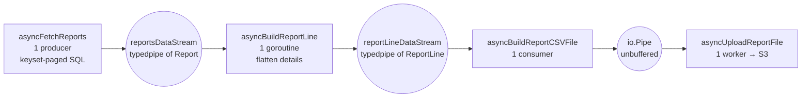
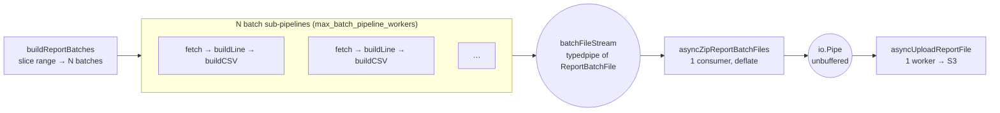

# Designing an Asynchronous, Stream-Only Report Exporter in Go

**A case study in job-based APIs, event-driven processing, and a backpressured streaming pipeline that keeps memory flat no matter how large the export gets.**

---

Every marketplace or payment platform eventually hits the same wall: a merchant clicks "export transactions" and the request times out. The naive implementation reads every row into memory, builds a CSV, and streams it back over HTTP — which works fine at 1,000 rows and falls apart at 10 million.

This article walks through `efficient-report-exporter`, a Go service that exports per-shop transaction reports as downloadable CSV/ZIP files. It's a deliberately small, single-purpose service, but it makes a handful of decisions worth studying: an asynchronous job-based UX, event-driven processing over RocketMQ, and an in-process streaming pipeline whose memory footprint does not grow with the data.

> **TL;DR** — the service exposes a three-call UX (request → poll → download), does the heavy lifting off-band, and processes rows through a chain of goroutines connected by in-memory streams with backpressure. Peak resident memory stays ~38 MiB whether the export is 100k or 5 million rows.

---

## 1. The problem

A synchronous export endpoint has three failure modes, all of which get worse as data grows:

1. **Time**: a large export can take seconds to minutes, far beyond any sane HTTP timeout.
2. **Memory**: if you `SELECT *` and marshal everything before responding, memory is `O(rows)`.
3. **Contention**: a slow client keeps a database connection (and server goroutine) pinned for the duration.

The standard fix is to stop answering "give me the file" and start answering "start a job, then ask for the file later." That's the core idea here: **turn a long-running synchronous operation into a job you can poll**, and generate the file **off-band**, streaming rows so memory never scales with volume.

---

## 2. Solution at a glance

From the client's point of view, the whole UX is three synchronous calls:



Legend: **solid** = synchronous, **dashed** = asynchronous.

1. **Request** — `POST /v1/reports/export` returns a `job_id` immediately (milliseconds).
2. **Poll** — `GET /v1/reports/export/:job_id` returns the job status; once `success`, it carries a presigned S3 URL (15-minute expiry).
3. **Download** — the client fetches the file directly from S3 via the presigned URL.

The export itself runs as step 0, hidden behind the scenes: the API publishes a message to RocketMQ, a consumer reads the rows, uploads the result to S3, and marks the job `success`.

Two consequences fall out of this shape:

- **The API stays fast and stateless** — it never touches the data, only the job table.
- **Delivery is decoupled from generation** — S3 serves the file; the service only mints a time-boxed URL.

---

## 3. Architecture

The service is two deployable binaries over a shared composition root, laid out in clean-architecture layers:



- `cmd/api` serves the REST API (Hertz); `cmd/mq` is the RocketMQ consumer.
- Handlers parse and validate; use cases hold the business logic; repositories wrap outbound side effects (MySQL, Redis, S3, RocketMQ) behind interfaces, which is what makes the whole pipeline unit-testable and benchmarkable without a running database.

The stack: **Go**, **Hertz** (HTTP), **MySQL**, **Redis**, **RocketMQ**, **S3/MinIO**, with **OpenTelemetry** for observability, **etcd** for dynamic config, and **Infisical** for secrets.

---

## 4. Core flows

### 4.1 Requesting an export

`POST /v1/reports/export` is designed to be *safe to retry*: it's idempotent by `request_id`.



Two interesting choices here:

- **A Redis lock keyed by `request_id`** deduplicates concurrent retries — a client that fires the same request twice gets the same `job_id`, not two jobs.
- **The job is inserted *before* the message is published**, so the job row is always the source of truth; a message can never arrive before its job exists.

### 4.2 Processing the job

The consumer receives `job_id`, guards against concurrent processing with a Redis lock, and routes the work:



The consumer first runs an index-backed `COUNT(*)` over the requested range and decides between two paths:

| Condition | Path | Output |
| --- | --- | --- |
| `COUNT(*) ≤ max_single_file_rows` (default 100k) | **single-stream** | one `report_<job_id>.csv` |
| `COUNT(*) > max_single_file_rows` | **date-batched** | one `report_<job_id>.zip` of date-partitioned CSVs |

This routing is the first design decision worth pausing on — it's covered in section 6.

---

## 5. The streaming pipeline

This is the heart of the service. The consumer doesn't collect rows into a slice and then format them. Instead, **every stage is a goroutine, and stages are connected by typed in-memory streams** — data flows through as values and is freed as it goes.

### 5.1 The single-stream path (a linear chain)



### 5.2 The batched path (fan-out + zip)



| Stage | Goroutines | Reads from | Writes to |
| --- | --- | --- | --- |
| `asyncFetchReports` | 1 | MySQL (keyset page) | `reportsDataStream` |
| `asyncBuildReportLine` | 1 | `reportsDataStream` | `reportLineDataStream` |
| `asyncBuildReportCSVFile` | 1 | `reportLineDataStream` | `io.Pipe` |
| `asyncBuildReportBatchFiles` | 1 fan-out + `N` workers | MySQL (per-batch range) | `batchFileStream` |
| `asyncZipReportBatchFiles` | 1 | `batchFileStream` | `io.Pipe` |
| `asyncUploadReportFile` | 1 | `io.Pipe` | S3 |

### 5.3 Why this shape — backpressure

The key property is **backpressure without coordination code**. The typed streams are buffered channels — `Write` blocks when full, `Read` blocks when empty. A slow stage therefore *throttles everything upstream*, end to end, automatically.

The `io.Pipe` between the CSV/zip writer and the S3 uploader is **unbuffered and synchronous**: the writer can't outrun the network upload. Even the S3 upload is streamed — the file is never materialized on disk or in a byte buffer; it flows from the DB cursor straight into the object store.

Concretely:

- Nothing is written to disk. Ever.
- Live memory is bounded by the stream buffers and the number of in-flight batches, **not** by the row count.
- Errors are fail-fast: the first failure cancels the whole `errgroup` (which recovers panics too), tears down every stage, and a deferred handler persists `status = failed`.

### 5.4 The read path — keyset pagination

Fetching uses **keyset pagination**, not `OFFSET`:

```text
SELECT ... WHERE shop_id = ? AND order_settlement_time BETWEEN ? AND ?
  AND (order_settlement_time > :last_settlement_time
       OR (order_settlement_time = :last_settlement_time AND id > :last_id))
ORDER BY order_settlement_time ASC, id ASC LIMIT ?
```

The cursor is the composite `(order_settlement_time, id)` of the last row, ordered by the same columns as the `(shop_id, order_settlement_time, id)` index suffix. Page cost stays constant regardless of depth — `OFFSET` would rescan everything before the page. Crucially, the `COUNT(*)` used for routing and the rows actually fetched are built from the same `WHERE` clause, so the routing decision can never drift from the data.

---

## 6. Design decisions & trade-offs

The project is mostly interesting for the decisions that are *visible* in the code. Four worth calling out:

**1. One job, two paths — chosen by row count.** Why not always batch? Because parallel fetch only pays off past a threshold. Below ~100k rows, a single serial fetch producing one CSV is simpler and cheaper than paying fan-out and zip overhead. `max_single_file_rows` is the single tuning knob for that trade-off.

**2. Streaming instead of buffering.** The alternative — build a big `[][]string` and dump it — is simpler, but `O(rows)` memory. Streaming costs a little complexity (stages, streams, lifecycle) and buys flat memory and the ability to start uploading before the last row is read.

**3. Flatten at the line stage, not in SQL.** Each DB row carries a `details` JSON array of fee details; the pipeline expands one row into one CSV line *per detail* at the `ReportLine` stage. This keeps the SQL simple and the fan-out logic out of the query.

**4. S3 + presigned URL for delivery.** The service never proxies file bytes back through the API — it mints a 15-minute presigned URL and hands it to the client. Delivery is offloaded to the object store.

There are honest trade-offs too (section 10): the zip stage is a single goroutine, and there's no resume/retry yet.

---

## 7. Performance

The README claims "memory stays flat" — I wanted to *prove* it, so I added Go benchmarks to the repo. They measure the in-process pipeline in isolation: rows are generated lazily page-by-page (mimicking keyset pagination, so the harness holds `O(1)` state), and the S3 upload drains into `io.Discard` (so no network I/O is measured).

> **Scope caveat** — these are *compute and memory* numbers, not end-to-end. The real-world cost is DB fetch + object upload, which a unit benchmark can't reproduce. That's what the next section is for.

### Throughput

Environment: AMD Ryzen 5 8400F (6-core), Go 1.26, linux/amd64.

| Path | Rows | Time | Throughput |
| --- | --- | --- | --- |
| single | 10k | 25.9 ms | ~386k rows/s |
| single | 50k | 114 ms | ~438k rows/s |
| single | 100k | 233 ms | ~430k rows/s |
| batched | 100k | 220 ms | ~455k rows/s |
| batched | 500k | 1.47 s | ~341k rows/s |
| batched | 1M | 3.05 s | ~327k rows/s |

The pipeline formats and uploads **~330–450k rows/s** on a single consumer. Note the interesting result: batched isn't dramatically faster here — because with an in-memory row source, the fetch is *not* the bottleneck. That's exactly the point: batched's parallel fetch only wins when the DB is the constraint. The benchmark isolates the compute path and shows it's not the limiting factor.

### End-to-end: real MySQL + MinIO

To measure the part that matters in production, I added an opt-in integration benchmark (`//go:build integration`) that wires the pipeline to a real MySQL and a real S3-compatible MinIO, seeded with rows across a 24-hour window (12 batches in the batched path). It reports wall-clock time for a full job — DB fetch, CSV/zip, and object upload:

```sh
go test -tags integration -run '^$' -bench 'BenchmarkReal' -benchtime=1x ./integration/
```

| Path | Rows | Time | Throughput |
| --- | --- | --- | --- |
| single | 100k | 1.03 s | ~98k rows/s |
| single | 500k | 5.00 s | ~100k rows/s |
| single | 1M | 10.0 s | ~100k rows/s |
| batched | 100k | 0.35 s | ~287k rows/s |
| batched | 500k | 3.57 s | ~140k rows/s |
| batched | 1M | 8.63 s | ~116k rows/s |

Three takeaways:

1. **Real end-to-end throughput is ~100k rows/s** for the single path — ~4× slower than the compute-only number. The 1M-row run fetches 1,000 keyset pages and uploads a ~313 MB CSV; DB + S3 are the real cost, exactly as the scope caveat predicted.
2. **The batched path is faster at every size** — the parallel fetch does pay off (CPU jumps to ~160–510% vs ~120% for single), and the gap widens as the DB becomes the constraint.
3. **This was not true at first — the first benchmark caught a real bug.** The original cursor was `id > last_seen_id ORDER BY id`, but `id` is the *third* column of the `(shop_id, order_settlement_time, id)` index, so the cursor couldn't be pushed into the range scan and MySQL did `Using filesort` over the entire batch on *every page* — an `O(n²)` fetch that made batched 500k take 15.5s. The fix was a composite keyset cursor `(order_settlement_time, id)` ordered by the same index suffix, which `EXPLAIN` confirms removes the filesort (`Using where; Using index`). The fixed batched path is the "worth keeping" one; the pre-fix numbers were measuring a bug, not the design.

### Memory: flat, by construction

"Memory usage" is ambiguous in Go, so I measure four different things and report them all, rather than cherry-picking the flattering one:

- **Live heap** (`HeapAlloc`) — reachable objects at a given instant.
- **Heap from OS** (`HeapSys`) — heap memory the allocator has obtained, including idle spans it retains for reuse.
- **Total from OS** (`Sys`) — everything the Go runtime has obtained (heap, stacks, GC metadata, …).
- **RSS** — the process's actual resident set size, the number the OS really charges.

The pipeline is sampled every 1 ms during the run; each metric is the *peak* observed:

| Rows | Live heap | Heap from OS | Total from OS | **RSS (real)** |
| --- | --- | --- | --- | --- |
| 100,000 | 8.0 MiB | 15.2 MiB | 22.9 MiB | **37.1 MiB** |
| 1,000,000 | 8.1 MiB | 19.2 MiB | 26.9 MiB | **37.6 MiB** |
| 5,000,000 | 8.2 MiB | 19.2 MiB | 26.9 MiB | **38.4 MiB** |

Two honest conclusions fall out:

1. **Live memory is flat** — ~8 MiB of reachable objects regardless of volume. Rows stream in page-by-page and are freed after the CSV writer emits them; only the stream buffers, the 1 MB writer buffer, and goroutine stacks stay resident. That's the streaming claim.
2. **The real footprint is ~38 MiB — and also flat.** The gap between the 8 MiB live set and the 38 MiB RSS is the allocator's retained idle heap plus the Go runtime's own reservations (stacks, GC metadata, binary, libc). It's easy to mislead with the 8 MiB number and ignore this; the point is that *neither* number grows with the data. Fifty times more rows, the same ~38 MiB of RSS.

Allocations *do* scale linearly with work (~23 allocs/row, ~820 MB allocated cumulatively for the 1M-row run) — that's expected — but they're transient, so resident memory doesn't.

---

## 8. Failure & consistency

Async systems earn their keep in failure handling. The model here is deliberately simple and explicit:

- **At-least-once delivery.** RocketMQ may redeliver a message after a crash. Re-processing is *safe but not resumable*: the consumer checks job status and skips `success` jobs, and a Redis lock (1-minute TTL) prevents two consumers from working the same job concurrently. A redelivery re-runs the whole job from scratch.
- **Fail-fast, no in-process retry.** The first pipeline error cancels the `errgroup`, tears down every stage, and persists `status = failed` with the error message. Retrying failed jobs is a separate (future) reconciliation concern.
- **Idempotent requests.** `request_id` dedup means a retried `POST` reuses the existing job instead of creating a duplicate.
- **Consistency of the job row.** The job is inserted before the message is published; the message carries only `job_id`, so the job table is always the source of truth.

---

## 9. Production readiness

A service isn't convincing without the operational layer:

- **Observability** — all three pillars (logs, metrics, traces) instrumented with OpenTelemetry, with distributed spans across HTTP handlers, MQ consumers, and repository calls.
- **Dynamic config** — pipeline knobs (`max_single_file_rows`, `query_limit_per_page`, `max_batch_pipeline_workers`, …) live in etcd and hot-reload via polling — no redeploy to retune the routing threshold.
- **Secrets** — DB/Redis/S3 credentials come from Infisical, not env files.
- **Layered composition** — two thin binaries (`api`, `mq`) over a shared composition root, so the whole service is wired once and unit-tested against repository interfaces.

---

## 10. Limitations & roadmap

Being honest about the gaps is what makes the design credible:

- **Single-threaded zip, and a coordination-heavy back half.** The zip stage is one `deflate` goroutine feeding a single upload consumer through an unbuffered `io.Pipe`; profiling shows the batched path spends most of its time in goroutine synchronization rather than compute, which caps the fan-out's benefit against a fast DB.
- **No resume/retry.** A crash mid-job restarts from zero; there's no per-batch checkpointing yet.
- **Fixed lock TTL.** The 1-minute process lock can expire mid-run for very long jobs; lock renewal is on the roadmap.
- **Deterministic ordering.** Zip entries currently follow batch-completion order, not chronological order.

The roadmap (checkpointed resume, lock renewal, reconciliation retries, timezone-correct batch bounds) is public in the repo — which is itself a signal that the trade-offs are understood, not ignored.

---

## Conclusion

The interesting engineering here isn't any single component — it's how the pieces compose:

1. A **job-based API** turns a long-running operation into a three-call UX.
2. **Event-driven processing** decouples the fast API from the slow export.
3. A **streaming pipeline** with backpressure keeps memory flat regardless of volume.
4. **Explicit failure semantics** (at-least-once, idempotent requests, fail-fast) make the async boundary safe.

The result is a service where the hardest claim — "memory doesn't grow with the data" — is not just asserted, but measured: ~38 MiB of resident memory whether you export 100,000 rows or 5,000,000.

> The code is at [github.com/fikrimohammad/efficient-report-exporter](https://github.com/fikrimohammad/efficient-report-exporter), including the benchmarks used for section 7.
