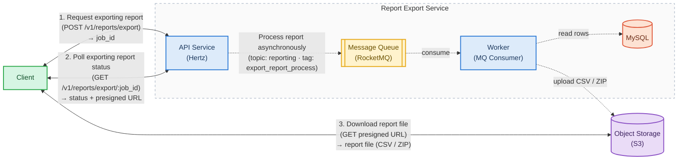

# Core UX — Report Export

The end-to-end user journey: the client makes **one** export request, then polls for
completion and downloads the result. All the heavy lifting happens out-of-band, so the
client never blocks on report generation.

Legend: **solid arrows** = synchronous call/response, **dashed arrows** = asynchronous
(event-driven, background).

| Step | Actor | Business process | Sync / Async |
| --- | --- | --- | --- |
| 1 | Client | Request exporting report (`POST /v1/reports/export`) — receives `job_id` immediately | Sync (fast) |
| — | Service | Process report asynchronously (publish to topic `reporting` / tag `export_report_process`): message → consumer → read rows → upload to S3 → mark job `success` | Async (background) |
| 2 | Client | Poll exporting report status (`GET /v1/reports/export/:job_id`) — receives `download_url` (presigned) once `success` | Sync |
| 3 | Client | Download report file (`GET` presigned URL) | Sync |

Key idea: from the client's point of view the flow is only three synchronous steps
(request → poll → download). The asynchronous processing runs behind the scenes.
